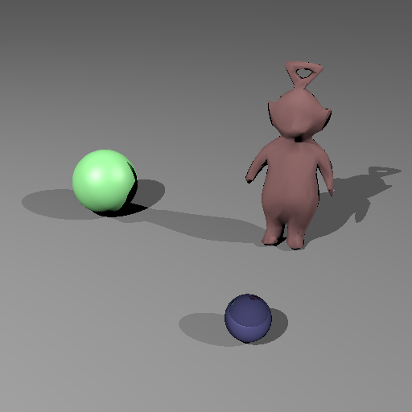

# Maillage triangulaire. 

## 1. Calcul d'intersection. 

La première image obtenue permettait de distinguer les trianges composant le personnage. Après avoir calculé les coordonées de texture, l'image obtenue est beaucoup plus lisse :

    

Après avoir augmenté le nombre de faces, l'image obtenue est meilleure, mais le temps de rendu augmente considérablement : 

    

## 2. BVH. 

